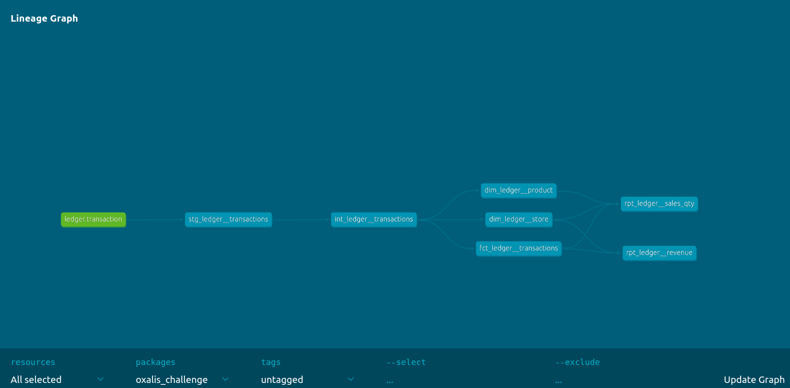

# Oxalis Coding Assessment

## Introduction

This project was created as a take-home coding assessment for Oxalis. It consists of an end-to-end data pipeline with the following components:

1. Import sales data from `example_sales_data.csv` into Python.
1. Clean and validate the sales data, standardizing the format and filling in missing data where possible.
1. Load the sales data into a PostgreSQL database.
1. Create dbt models transforming and then aggregating the data to produce potentially useful insights.

## Usage

### Requirements

1. [dbt Core](https://docs.getdbt.com/guides/manual-install?step=1)
1. [Docker Compose](https://docs.docker.com/compose/install/)
1. Git
1. Pip
1. [Python v3.10+](https://www.python.org/downloads/release/python-31014/)
1. [Python-Poetry](https://python-poetry.org/)
1. [NumPy](https://numpy.org/install/)
1. [Pandas](https://pandas.pydata.org/pandas-docs/stable/getting_started/install.html)

For a full list of requirements, see `requirements.txt` and `pyproject.toml` in this directory.

### Installation and Usage

1. Install all necessary dependencies.
1. Clone this repository.
1. Run `bash run.sh` from within this top-level directory to build container and models.
1. Open `dbt/oxalis_challenge/target/static_index.html` in your browser to interactively view data models and lineage graph.

## Ideal Features

Below is an incomplete list of features that I would add to this project if I expected to deliver it to clients for their use.

1. Write additional explanatory documentation, especially installation and usage details.
1. Automatically generate a dummy sales data file so that the user can clone the repository and run the entire container without already having the required `example_sales_data.csv` file.
1. Automatically test all components of the Python code using (e.g.) a `pytest` framework.
1. Add inline comments and complete docstrings to all Python scripts (in a manner similar to my personal toolbox, ["gconanpy"](https://github.com/GregConan/gconanpy)).
1. Modify `oxalis_challenge/data_cleaners.py` to handle multiple transactions per date.
1. Modify `oxalis_challenge/psql_loaders.py` to allow incremental loading.

## Data Model

### Data Tables

#### `raw_transaction`

| column_name | data_type |
|:-:|:-:|
| quantity       | bigint |
| transaction_id | bigint |
| discount       | double |
| date           | timestamp |
| price          | double |
| store_id       | bigint |
| region         | text |
| product_name   | text |
| customer_type  | text |
| payment_method | text |

### Lineage Graph



## Directory Structure

```sh
.
├── Dockerfile
├── README.md
├── app.py
├── data/
│   └── example_sales_data.csv
├── dbt/
│   └── oxalis_challenge/
│       ├── README.md
│       ├── analyses
│       ├── dbt_packages
│       ├── dbt_project.yml
│       ├── macros
│       ├── models
│       │   ├── intermediate
│       │   │   ├── int_ledger__transactions.sql
│       │   │   └── properties.yml
│       │   ├── marts
│       │   │   ├── dim_ledger__product.sql
│       │   │   ├── dim_ledger__store.sql
│       │   │   ├── fct_ledger__transactions.sql
│       │   │   └── properties.yml
│       │   ├── report
│       │   │   ├── rpt_ledger__revenue.sql
│       │   │   └── rpt_ledger__sales_qty.sql
│       │   ├── sources.yml
│       │   └── staging
│       │       ├── properties.yml
│       │       └── stg_ledger__transactions.sql
│       ├── profiles.yml
│       │   ├── run_results.json
│       │   └── semantic_manifest.json
│       └── tests
├── docker-compose.yml
├── oxalis_challenge
│   ├── __init__.py
│   ├── cli.py
│   ├── config.py
│   ├── data_cleaners.py
│   └── psql_loaders.py
├── poetry.lock
├── pyproject.toml
├── requirements.txt
└── run.sh
```